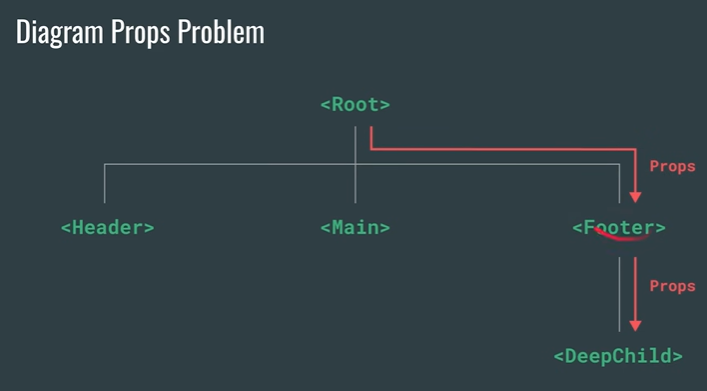
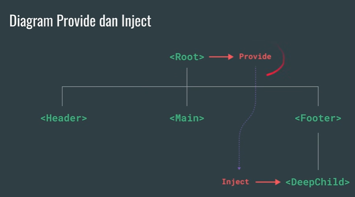

# Vue 3 + Vite

---

# Proses Install
## install vue project
```git
    npm create vit@latest VueJs-Project -- --template vue
```

## menjalankan vue project
```git
    npm run dev
```

---

## Contoh Single File Component
```vue
    <template>
    <!-- HTML template -->
    </template>

    <script>
    // JavaScript logic
    </script>

    <style>
    /* CSS styling */
    </style>
```

# API Style
## Contoh dengan Option API
```vue
    <script>
    export default {
        data(){
            return{
                count: 0
            }
        }
    },
    methods:{
        increment(){
            this.count++
        }
    },
    mounted(){
        console.log('The initial count is ${this.count}.')
    }
    </script>
    <template>
        <button @click="increment">Count is: {{count}}</button>
    </template>
```

## Contoh dengan Composition API
```vue
    <script setup>

        import { ref, onMounted } from 'vue'

        const count = ref(0)

        function increment = () {
            count.value++
        }

        onMounted(() => {
            console.log(`The intial count is ${count.value}.`)
        })
    </script>

    <template>
        <button @click="increment">count is : {{count}}</button>
    </template>
```

---

# Template
perintah directive v-bind:nama-attribute
```vue
    v-bind:class
    :id
    :class
    v-html
```

---

# Boolean Attribute
penggunaan biasanya pada kasus disabled dan check

---

# Multiple Attributes
Directive v-bind juga mendukung mengubah beberapa attribut sekaligus menggunakan JavaScript Object</br>
Kita hanya perlu siapkan data object yang berisi field nama attribute nya
```vue
    <script>
        const hello = "<h1>Hello Vue</h1>"
        const buttonDisabled = true;
        const data = {
            id: "hello",
            class: "hello",
        }
    </script>
    <template>
        <h1 v-bind="data">{{hello}}</h1>
        <div :class="data.class" v-html="hello"></div>
        <button :disabled="buttonDisabled">This is Button</button>
    </template>
```

---

# JavaScript Expression di Template
JavaScript Expression adalah kode yang menghasilkan nilai, dari mulai variable sampai memanggil function
```vue
    <script>
       function hellofunction(){
        return "Hello world";
       }
    </script>
    <template>
       <h2>{{ 100 * 200}}</h2> 
       <h2>{{hellofunction}}</h2>
    </template>
```

---

# Directive Arguments
Beberapa jenis Directive, bisa memiliki Arguments</br>
Directive Argument ditandai dengan tanda : (titik dua) setelah Directive nya</br>
href pada v-bind adalah Argument</br>
Selain v-bind, ada juga seperti contohnya Directive v-on:click

---

# Dynamic Arguments
Directive juga mendukung Dynamic Arguments, yang artinya nama Argument bisa menggunakan JavaScript Expression</br>
Untuk menggunakan Dynamic Argument, kita bisa gunakan [] kurung kotak, dimana didalam kurung kotaknya, kita bisa tambahkan JavaScript Expression</br>
Misa kita bisa gunakan v-bind[fromVariable], diamna misal fromVariable adalah variable dari kode JavaScript</br>
Ekspektasi value dari Dynamic Argument adalah String, namun selain String, kita juga bisa gunakan null, jika nilai dari Dynamic Argument adalah null, artinya kita ingin menghapus Argument tersebut

---

# Modifier
Modifier adalah suffix (akhiran) yang terdapat di Directive yang diawali dengan karakter. (titik)</br>
Beberapa Directive memiliki Modifier, contohnya adalah Directive v-on, misal </br>
v-on:submit.prevent="onSubmit"</br>
v-on adalah Directive</br>
Submit adalah Attribute</br>
Prevent adalah Modifire</br>
"onSubmit" adalah value

---

# State
Saat kita membuat halaman web, kita mungkin akan menyimpan data (state) di JavaScript</br>
Misal,ketika kita membuat halaman untuk menampilkan data Counter berapa banyak pengguna mengklik tombol, kita bisa menyimpan state (data saat ini) di JavaScript

---

# Reactive State
Pada kode sebelumnya, kita mengubah counter secara manual menggunakan manipulasi DOM. Sebenarnya hal ini tidak direkomenadiskan lagi jika menggunakan Vue</br>
Vue menyediakan fitur bernama Reactive State, fungsinya sama untuk menyimpan State (data)</br>
Yang membedakan dengan kita membuat variable sendiri adalah, saat kita mengubah State, maka Vue akan melakukan render ulang Component nya, sehingga Component akan ditampilkan ulang dengan data State yang baru yang sudah kita ubah</br>
Untuk membuat Reactive State, kita bisa menggunakan function ref()</br>
https://vuejs.org/api/reactivity-core.html#ref

---

# Kenapa Reactive State?
Kita harus menggunakan reff dibanding lakukan secara manual?</br>
Ketiak di Template menggunakan ref, lalu kita mengubah value di ref. Vue secara otomatis mendeteksi perubahannya, dan kemudian mengupdate DOM</br>
Vue menggunakan object dengan attribut value sebagai State, agar bisa meng-intercept perubahan data dari get dan set operations, sehingga dengan mudah Vue bisa mendeteksi State mana yang berubah, dan melakukan render ulang Component tersebut di DOM</br>
https://javascript.info/property-accessors

---

# DOM Update
Saat kita mengubah State di Vue, Vue tidak melakukan render saat itu juga</br>
Vue memiliki jadwal untuk melakukan render, hal ini agar jika terjadi perubahan banyak State dalam waktu waktu, Vue bisa menunggu dulu sampai semua perubahan State selesai, baru melakukan render ulang</br>
Jadwal Vue melakukan render ulang selanjutnya kita sebut dengan "next tick"</br>
Jika misal kita ingin melakukan sesuatu setelah proses render ulang selanjutnya selesai, kita bisa menunggunya dengan cara memanggil function nextTick()</br>
https://vuejs.org/api/general.html#nexttick

---

# Reactive
Selain membuat Reactive State menggunakan ref(). kita juga membuat Reactive State menggunakan reactive()</br>
https://vuejs.org/api/reactivity-core.html#reactive</br>
Namun, penggunaan reactive() ini digunakan untuk tipe data complex, karena hasil dari reactive() ini adalah JavaScript Proxies, dimana tiap perubahan ke data nya akan dideteksi oleh Vue, sehingga Vue bisa melakukan render ulang Component setelah mendeteksi perubahan</br>
https://developer.mozilla.org/en-US/docs/Web/JavaScript/Reference/Global_Objects/Proxy

---

# Keterbatasan Reactive
Saat kita menggunakan reactive() terdapat beberapa keterbatasan dibanding ref()</br>
Karena menggunakan JavaScript Proxy, jadi hanya tipe data objects(object, array, collection) yang bisa digunakan, tidak bisa untuk tipe data primitive(string, number, boolean)</br>
Tidak bisa di replace seluruh object nya, karena akan menjadikan Proxy diubah dengan object baru, sehingga Vue akan kehilangan kemampuan untuk melakukan track perubahan data</br>
Tidak aman saat menggunakan Destructuring Object, karena saat kita melakukan Destructuring Object, secara otomatis hasil Destructuring tersebut keluar dari JavaScript Proxy

---

# Masalah Dengan Method
Sampai saat ini, mungkin kita tidak melihat ada masalah.</br>
Tapi sebenarnya ada masalah yang terjadi ketika kita membuat method / function </br>
Masalahnya adalah, setiap Component di render-ulang, maka method/function tersebut akan dipanggil lagi, walaupun tidak ada state yang berubah</br>
Jika method / function sebenarnya mengembalikan value yang sama, dikarenakan State nya tetap sama, maka alangkah lebih baiknya kita tidak perlu mengeksekusi ulang logic dari method nya

---

# Compute Properties
Masalah ini sudah disediakan solusinya oleh Vue, yaitu menggunakan computed() function</br>
https://vuejs.org/api/reactivity-core.html#computed</br>
Vue bisa tahu isi State yang digunakan di dalam computed() function, dan ketika terjadi perubahan di State tersebut, maka function di computed() akan dipanggil ulang</br>
Jika tidak ada State yang berubah, maka function di computed() tidak akan dipanggil ulang(atau di Cache)</br>
Return value dari computed() mirip seperti ref(), yaitu object {value}

---

# Style
Salah satu yang bisa dilakukan saat membuat Component adalah menambahkan Style </br>
Saat menambahkan Style, kita bisanya menggunakan attribute class atau style, dan karena itu adalah attribute, kita bisa menggunakan Directive v-bind jika butuh value JavaScript Expression</br>
Salah satu hal menari di Vue adalah, saat v-bind menggunakan argument class atau style, value nya bisa menggunakan Object dan Array

---

# Binding HTML Class
Saat menggunakan v-bind:class, kita bisa menggunakan object, dimana jika value object bernilai true, secara otomatis attribute akan dijadikan class nya</br>
Selain object, kita juga bisa menggunakan array

---

# Binding Inline Style
Selain menggunakan attribute class, kita juga bisa menggunakan attribute style jika ingin membuat inline style</br>
Sama seperti class, v-bind:style juga mendukung value Object atau Array</br>
Berbeda dengan style yang menggunakan value boolean pada Object-nya, pada style, kita harus menyebutkan value CSS nya</br>
Dan untuk Array, digunakan untuk menggabungkan beberapa Object style

---

# Scoped CSS
Saat kita membuat style pada komponen dengan attribut scoped</br>
Itu artinya Style tersebut hanya digunakan di Componet tersebut</br>
Hal ini membuat kita mudah melakukan maintain style CSS, karena tidak perlu khawatir bentrok dengan style di Component lainnya

---

# Conditional Rendering
Saat kita membuat Component, kita pasti akan sering sekali menambahkan kondisi</br>
Misal jika kondisi terpenuhi, maka component/ element akan ditampilkan, jika tidak, maka component/element tidak perlu ditampilkan</br>
Vue menyediakan banyak directive untuk melakukan Conditional Rendering</br>
Ada v-if untuk kondisi if, v-else-if untuk kondisi else if dan v-else untuk kondisi else</br>
Kita bisa tempatkan di template atau di element HTML

---

## Show
Saat menggunakan Directive if, else-if dan else, Element yang kita tambahkan Directive tersebut tidak akan ditambahkan ke DOM jika tidak dibutuhkan</br>
Jadi bukan menghilangkan tampilan menggunakan CSS display</br>
Namun, ada Directive yang bisa digunakan untuk menghilangkan element menggunakan CSS display, yaitu v-show</br>
Namun saat menggunakan v-show, artinya element tetap akan ditambahkan ke DOM

---

## List Rendering
Salah satu hal yang biasa dilakukan dalam halaman web, menampilkan kumpulan data dan Array menjadi element</br>
Biasanya, hal ini kita lakukan menggunakan perulangan</br>
Hal ini juga sama bisa dilakukan di Vue menggunakan Directive v-for </br>
Kita bisa menggunakan v-for untuk melakuan iterasi terhadapa data Array</br>
Value pada Directive v-for, bisa kita gunakan seperti menggunakan for loop di JavaScript, misal "item in items" atau "(item, index) in items"

---

## List for Object
Selain melakukan interasi terhadap Array, Directive v-for juga bisa digunakan untuk melakukan iterasi attribute yang ada di Object</br>
Caranya sama seperti melakukan iterasi object di JavaScript, kita bisa menggunakan value "value in object" atau "(value, key) in object"

---

## List for Range
Kadang-kadang, kita misal hanya ingin melakukan iterasi element sejumlah berapa kali</br>
Directive v-for juga bisa digunakan untuk Range caranya bisa mengguankan value "n in number", dimana dimulai dari 1 sampai number

---

## Key
Saat melakukan render ulang pada List Rendering, Vue akan melakukan strategi "in-place patch". Jika urutan element berubah, dibanding memindahkan element pada DOM, Vue akan menimpa setiap element dengan data element yang baru.</br>
Strategi ini mungkin baik ketika element yang ditampilkan sederhana, namun jika kompleks, maka bisa memperlambat proses karena tiap perubahan akan me-replace ulang semua element</br>
Untuk memberi tahu id element ke Vue, kita bisa menambahkan key pada element, sehingga Vue tidak akan melakukan replace seluruh element, hanya akan memindahkan atau mengubah element yang berubah saja</br>
Caranya kita bisa tambahkan binding attribute key pada element nya

---

## v-for dan v-if
Directive v-for dan v-if, bisa langsung di integrasikan dalam satu element</br>
Directive v-if memiliki prioritas yang utama dibanding v-for, jadi jika kondisi v-if terpenuhi, baru iterasi di v-for dilakukan</br>
Jadi jangan sampai salah mengintegrasikan v-for dan v-if, kita akan lihat contoh benar nya
## (benar)
```vue
<script setup>
const items = [
    {
        id: 1,
        Text: "learn vue 3",
        done: true
    },
    {
        id: 2,
        Text: "learn vue Router",
         done: false
    },
    {
        id: 3,
        Text: "learn vue pinia",
         done: false
    }
];
</script>

<template>
    <h1>Todo List</h1>
    <ul v-for="item in items" v-bind:key="item.id" v-if="!item.done">
        <li v-for="(value, key) in item" v-bind:key="key">
           {{ key }}: {{ value }}
        </li>
    </ul>

    <div>
        <h1  v-for="i in 10">Hello {{ i }}</h1>
    </div>
</template>
```

---

## Event Handling
Untuk menambahkan Event Handling pada element, kita bisa menggunakan Directive v-on, diikuti dengan argument berupa nama event nya, misal v-on:click=""</br>
Atau, kita bisa menggunakan shortcut menggunakan simbol @, misal @click=""</br>
Value dari Directive v-on bisa diisi dengan function | Inline Statement | Object (without argument)</br>
https://vuejs.org/api/built-in-directives.html#v-on</br>
Hampir semua Event Handler bisa dilakukan di Vue</br>
https://developer.mozilla.org/en-US/docs/Web/Events

---

## Inline Statement
Pada kasus sederhana, kita juga menggunakan Inline Statement sebagai value di Directive v-on</br>
Contoh menaikkan increment</br>
Atau memanggil function secara langsung

---

## Event Argument
Saat kita membuat Event Handler di JavaScript, kita tahu bahwa kita bisa mengakses Event Object pada parameter di Event Handling Function nya </br>
Hal ini juga bisa dilakukan di Vue, kita bisa menambahkan parameter Event Object</br>
https://developer.mozilla.org/en-US/docs/Web/API/Event

---

## Event Modifier
Sangat biasa ketika kita membuat Event Handler, kita memanggil event.preventDefault() atau event.stopPropagation()</br>
Hal ini sangat mudah dilakukan di Directive v-on</br>
Kita cukup menambahkan event modifier saat menambahkan v-on atau @ </br>
Vue menyediakan banyak Modifier, seperti Event Modifier, Key Modifier dan Mouse Modifier</br>
https://vuejs.org/guide/essentials/event-handling.html#event-modifiers</br>
https://vuejs.org/guide/essentials/event-handling.html#key-modifiers</br>
https://vuejs.org/guide/essentials/event-handling.html#mouse-button-modifiers

---

## Input Binding
Saat kita membuat form di frontend, kadang kita harus melakukan sinkronisasi dengan data di state</br>
Hal yang bisa kita lakuan sepserti pada materi sebelumnya, menambahkan Event Handler lalu melakukan update data di state secara manual di Event Handler</br>
Untungnya, Vue menyediakan Directive v-model, yang bisa kita gunakan untuk melakukan sinkronisasi dan State dengan Input</br>
https://vuejs.org/api/built-in-directives.html#v-model

---

## Supported Input Binding
Directive v-model mendukung banyak Input Binding</br>
Element input dan textarea akan menggunakan attribut value dan menggunakan @input event</br>
Element input type checkbox dan radio, menggunakan attribute checked dan menggunakan @change event</br>
Element select menggunakan attribute value dan menggunakan @change event

---

## Model Modifier
Saat kita menggunakan v-model, kita bisa menggunakan beberapa modifier</br>
.lazy, yang digunakan untuk mengubah data ketika menjadi event @change, bukan event @input</br>
.number, yang digunakan untuk mengubah data menjadi number secara otomatis</br>
.trim, yang digunakan untuk menghapus whitespace di awal dan akhir value

---

## Watchers
Vue memiliki fitur bernama watch() function, yang digunakan untuk meregistrasi callback function yang akan di trigger otomatis ketika sebuah state berubah</br>
Kita bisa melakukan banyak hal di watch() function, misal mengubah DOM memanggil API lain ketika terjadi perubahan di state menggunakan watch() function ini </br>
Watch() function memiliki 3 parameter, source, callback function dan options</br>
https://vuejs.org/api/reactivity-core.html#watch</br>
Source pada watch() bisa berupa getter function, ref, reactive, atau array yang berisi data tersebut

---

## Watcher Options
Secara default, watch() function itu lazy, artinya menunggu source berubah dulu, baru callback function akan ditrigger. dan akan di trigger ulang jika source berubah lagi</br>
Kita bisa menambah options di watch() untuk mengubah behavior dari watch() function </br>
Kita bisa menambah options immediate: tru jika ingin watch() langsung mengeksekusi callback saat pertama kali, ini cocok jika kita ingin load data awal langsung</br>
Kita bisa menambah options once: true, jika hanya ingin mentrigger callback function hanya sekali, sehingga ketika source berubah, tidak akan di trigger ulang

---

## Watch Effect
Salah satu yang bisa dilakukan saat menggunakan watch() adalah, menggunakan state sebagai source, dan menggunakan immediate: true agar watch() langsung mengeksekusi callback funciton</br>
Vue memiliki shortcut function yang watchEffect(callback), yang bisa digunakan sebagai pengganti watch()</br>
Function WatchEffect() secara otomatis akan bersifat immediate:true dan juga akan melakukan track state yang terdapat di callback function </br>
https://vuejs.org/api/reactivity-core.html#watcheffect

---

## Cleanup
Pada beberapa kasus, mungkin kita ingin melakukan proses cleanup sebelum proses trigger ulang callback function di watch selanjutnya</br>
Untuk melakukan itu, di dalam callback function watch, kita bisa menggunakan onWatcherCleanup()</br>
Namun onWatcherCleanup() tidak mendukung async, sehingga kita harus registrasikan sebelum kita menggunakan await jika menggunakan async function</br>
https://vuejs.org/api/reactivity-core.html#onwatchercleanup

---

## Template Refs
Vue sendiri sudah memiliki fitur untuk melakkukan Input Binding menggunakan Directive v-model</br>
Namun, pada keadaan tertentu, mungkin kita masih butuh mengakses langsung element di DOM</br>
Kita bisa saja menggunakan DOM API yang bisa kita lakukan, namun Vue memberi cara yang lebih mudah, menggunakan Ref</br>
Dalam element, kita bisa tambahkan attribut ref yang bisa digunakan untuk melakukan binding dari element ke variable di JavaScript</br>
Caranya kita perlu menggunakan useTemplateRef() untuk membuat variable nya</br>
https://vuejs.org/api/composition-api-helpers.html#usetemplateref

---

## Ref dalam v-for
Kita juga bisa menambahkan ref pada element yang menggunakan Directive v-for</br>
Namun, hasil dari Element Binding nya adalah Array, karena bisa lebih dari satu element

---

## Lifecycle Hooks 
Setiap component Vue dibuat dan ditampilkan, terdapat tahapan alur hidup yang dilalui</br>
Dan kita diberi kemudahan untuk melakukan sesuatu pada setiap alur hidup component, sehingga mempermudah kita ketika ingin melakukan proses pada tiap alur hidup nya</br>
Kita bisa melihat alur hidup component Vue pada diagram berikut:</br>
https://vuejs.org/guide/essentials/lifecycle.html#lifecycle-diagram

---

## Lifecycle Hooks API
Jika kita ingin menambahkan kode pada tahapan alur hidup, kita bisa menggunakan function disediakan oleh Vue</br>
https://vuejs.org/api/composition-api-lifecycle.html

---

## Component
Sebelumnya, di awal materi kita sudah bahas tentang Component</br>
Mulai materi ini, kita akan bahas tentang Component lebih dalam lagi, dan fitur-fitur apa saja yang ada di Component

---

## Single File Component
Seperti yang sudah kita tahu, Vue membuat komponen dalam SFC (Single File Component) dalam file.vue</br>
Dalam file tersebut, terdapat kode JavaScript, Template dan CSS</br>
Saat membuat Component, biasanya menggunakan format PascalCase

---

## Menggunakan Component
Untuk menggunakan Component, cara penggunaanya seperti menggunakan tag html</br>
Sebelumnya, kita selalu memanggil Component menggunakan createAPP()</br>
Sebenarnya, kita bisa memanggil Component di dalam Component lainnya

---

## State Scope
Saat kita memanggil Component yang memiliki State didalamnya, perlu diketahui bahwa State itu akan berada di dalam instance Component nya</br>
Artinya ketika kita memanggil Component yang sama berkali-kali, maka State akan dibuat dalam instance Component itu, dan akan saling terisolasi satu sama lain</br>
Jadi kita tidak perlu khawatir State akan bentrok antar component

---

# Component Props
Component bisa memiliki properties, sehingga saat memanggil Component kita bisa menambahkan value pada property menggunakan seperti attribute pada element</br>
Untuk menambahkan properties, kita bisa menggunakan function defineProps()</br>
https://vuejs.org/api/sfc-script-setup.html#defineprops-defineemits

---

## Aturan Props
Saat kita membuat Props, biasanya kita membuat dengan format camelCase</br>
Namun saat menambahkan attribut pada Component, kita menggunakan bebab-case</br>
Misal jika kita punya Props firstName dan lastName, maka saat menggunakan attribute di Component, kita gunakan first-name dan last-name</br>
Saat menggunakan attribute untuk mengubah value Props, kita juga bisa menggunakan Directive v-bind, sama seperti pada attribute biasanya di DOM element

---

## One-Way Date Flow
Semua Props itu sifatnya One-Way Daya Flow darai Parent ke Child Component</br>
Artinya, Ketika Props itu berubah dari Parent, secara otomatis akan berubah ke semua Child nya</br>
Tapi tidak sebaliknya, jika kita ubah Props di Child, maka Parent tidak akan berubah datanya</br>
Oleh karena itu, biasanya Props itu memang digunakan sebagai data readonly di Child, hanya Parent yang biasanya mengubah data Props</br>
Contoh misal, kita akan buat component baru CounterStateless, dimana data counter akan dilakuakn di Parent

---

## Prop Validation
Sebelumnya, pada Counter kita lakukan konversi tipe data dari Props menjadi Number. Hal ini sangat menyulitkan jika harus dilakukan manual</br>
Component boleh menentukan requirement untuk Props, seperti tipe datanya, dan wajib atau optional. Atau Kita bilang Prop Validation</br>
Caranya saat kita menggunakan defineProps(), kita gunakan parameter Object, dimana kita tentukan key sebagai nama props, dan berisi Object lagi yang berisikan type untuk tipe data, required untuk wajib atau tidak, default untuk default datanya dan validator untuk function validasi jika dibutuhkan</br>
https://vuejs.org/guide/components/props.html#prop-validation

---

## Component Event
Selain Props, kita juga menambahkan Event Handler ke COmponent</br>
Caranya, kita bisa menggunakan function defineEmits()</br>
https://vuejs.org/api/sfc-script-setup.html#defineprops-defineemits</br>
Jika kita menambahkan Event ke Component, maka kita bisa menggunakan Directive v-on atau @ pada event nya ketika kita menggunakan Component tersebut

---

## Event Parameter
Saat kita memanggil Event, kita juga bisa menambahkan parameter</br>
Caranya tinggal tambahkan ke parameter kedua dan seterusnya ketika memanggil event nya</br>
Misal, data nilai increment akan kita kirim via Props, lalu value tersebut kita kan kirim ke Eventnya

---

## Component Model
Sebelumnya, kita sudah belajar tentang Input Binding menggunakan Directive v-model. Hal ini juga bisa dilakukan di Component</br>
Kita bisa implementasi Binding Component dengan data menggunakan function defineModel()</br>
https://vuejs.org/api/sfc-script-setup.html#definemodel

---

## Model Option
Saat ktia membuat Model menggunakan defineModel(), kita bisa menambahkan option untuk mengatur data Model</br>
Kita bisa gunakan required : boolean untuk menentukan apakah model wajin atau tidak </br>
Kita bisa gunakan type untuk menentukan jenis tipe data</br>
Kita bisa gunakan default untuk menentukan default value jika tidak diisi

---

## Model Argument
Saat kita membuat Model, kita bisa menambahkan Argument pada model ketika menggunakan defineModel(argument,option)</br>
Dengan menggunakan Argument, kita bisa membuat Model lebih dari satu untuk sebuah Component, asalkan nama Argument nya berbeda</br>
Contoh kita akan coba buat Component ContactList.vue, namun kita tidak akan menggunakan 1 model, melainkan tiap field Contact kita akan jadikan sebagai Model Argument

---

## Model Getter dan Setter
Model Option memiliki Getter dan Setter dalam key get dan set</br>
Dengan menggunakan Getter dan Setter ini, kita bisa melakukan logic sebelum data diambil(getter), dan sebelum data diubah (setter)</br>
Misal, kita ingin di ContactForm, data email harus selalu uppercase, jadi ketika data contact diambil, kita akan ubah dulu email nya menjadi uppercase

---

## Model Modifier
Model juga bisa memiliki modifier</br>
Seperti yang kita tahu bahwa modifier ditambahkan dengan titik diikuti nama modifier</br>
Untuk mendapatkan modifier yang digunakan, kita bisa melakukan Array Destructuring ketika membuat defineModel(), misal</br>
const[name, modifiers] = defineModel("name")</br>
Variable modifiers akan berisikan object dengan key berupa nama modifier yang digunakan</br>
Model Modifier sangat cocok dikombinasikan dengan getter dan setter.</br>
Sekarang kita akan coba tambahkan modifier di ContactList.vue

---

## Fallthrough Attributes
Fallthrough Attributes merupakan attribute atau event listener yang diteruskan oleh Component, tapi tidak secara explicit dideklarasikan menggunakan Props defineProps() atau Event defineEmits(). Contoh misal nya attribute class, style dan id</br>
Ketika kita membuat Component yang didalam template nya hanya berisi single element, maka secara otomatis Fallthrough Attributes akan ditambahkan ke element tersebut dari Component</br>
Misal, kita akan membuat component MyButton, dan isinya hanya button </br>
Secara otomatis attribute yang ditambahkan di MyButton akan ditambahkan ke button

---

## Menonaktifkan Fallthrough Attributes
Jika kita tidak ingin menggunakan Fallthrough Attributes, sehingga attribute tidak diteruskan ke element di dalam Component, kita bisa menambah options pada Component dengan menggunakan method defineOptions()</br>
https://vuejs.org/api/sfc-script-setup.html#defineoptions</br>
Kita bisa gunakan key inheritAttrs : false</br>
Secara otomatis attribute tidak akan diteruskan/ diwariskan ke element

---

## Mengakses Fallthrough Attributes di JavaScript
Jika kita butuh mengakses Fallthrough Attributes di JavaScript, kita bisa menggunakan function useAttrs()</br>
https://vuejs.org/api/composition-api-helpers.html#useattrs</br>
Namun perlu diperhatikan, attribute yang didefinisikan di Props(defineProps) atau Event (defineEmits), tidak akan didapatkan menggunakan useAttrs()

---

## Component Slot
Saat kita membuat Component, kadang ada kasus dimana Component tersebut bisa diisi template</br>
Contoh kita buat Component Layout atau Container, dimana isi content nya bisa diisi dengan template lain</br>
Pada kasus itu, kita bisa gunakan fitur bernama Slot</br>
Caranya, kita bisa menggunakan tag slot di dalam Component tersebut, secara otomatis nanti kita bisa mengubah isi slot dengan template ketika kita menggunakan Component tersebut

---

## Fallback Content
Slot bisa memiliki Fallback Content, kita cukup isi dalam tag slot</br>
Fallback Content akan ditampilkan, jika ketika kita menggunakan Component yang memiliki Slot, kita tidak menambahkan template di dalamnya

---

## Named Slot
Component juga mendukung memiliki banyak Slot, namun saat kita membuat banyak Slot, kita perlu memberi nama pada Slot tersebut</br>
Fitur ini socok ketika kita ingin membuat Component berupa Layout Template </br>
Misal, kita akan ubah Container tersebut menjadi memiliki slot untuk Header, Content dan Footer</br>
Kita bisa menentukan Slot yang menjadi default dengan nama default </br>
Dan ketika menggunakan Component yang memilik banyak SLot, kita bisa menentukan Slot mana yang ingin kita isi dengan menggunakan Directive v-slot</br> 
https://vuejs.org/api/built-in-directives.html#v-slot</br>
Atau bisa menggunakan shortcut #namaslot

---

## Conditional Slot
Kadang, mungkin kita ingin melakukan pengecekan apakah Slot tersedia atau tidak</br>
Jika tidak, misal kita memang tidak ingin menampilkan element apapun Kita bisa mendapat informasi Slot menggunakan function useSlots()</br>
https://vuejs.org/api/composition-api-helpers.html#useslots</br>
Lalu, kita bisa melakukan pengecekan menggunakan Directive v-if

---

## Scoped Slot
Saat kita mengisi Slot menggunakan template, kita tahu bahwa itu dilakkukan di Parent Component nya.</br>
Artinya kita tidak bisa mengakses State yang terdapat di dalam Child Componentnya </br>
Namun, mungkin ada kondisi dimana isi dari Slot ingin bisa mengakses Parent State dan juga Child State</br>
Hal ini bisa dilakukan dengan mudah, caranya kita bisa mengirim attribute ke slot, dan secara otomatis attribute tersebut bisa diakses di konten Slot

---

## Mengakses Attribute dari Slot
Cara mengakses attribute dari content Slot caranya kita bisa menggunakan v-slot="namaVariable"</br>
Selanjutnya kita bisa mengakses semua attribut nya menggunakan variable namaVariable</br>
Jika janya ada satu Slote, kita bisa gunakan v-slot di COmponent, jika ada multiple Slot, kita bisa gunakan v-slot di tiap templatenya

---

## Dynamic Component
Kadang ada kasus dimana kita ingin berpindah dari satu Component ke Component yang lain di satu lokasi DOM. Misal kita membuat Tab contohnya</br>
Atrinya data di lokasi Dom tersebut bisa dinamis dan berganti-ganti Component</br>
Untuk melakukan hal itu, kita bisa memanfaatkan tag component dan attribute is untuk menentukan apakah Component tersebut harus muncul atau tidak </br>
https://vuejs.org/api/built-in-special-elements.html#component</br>
https://vuejs.org/api/built-in-special-attributes.html#is

---

## Props Problem
Biasanya saat kita ingin mengirim kan data dari Parent ke Child dan ke Child nya lagi, maka kita harus menggunakan Props. Artinya tiap Child harus membuat Props yang sama agar bisa dikirim ulang oleh Chlid diatasnya</br>
Hal ini kadang bisa menjadi masalah karena terlalu banyak kode yang harus dibuat, dan pastinya rentan terjadi kesalahan dalam pembuatan kodenya


---

## Provide dan Inject
Masalah Props tersebut, bisa kita atasi dengan provide() dan inject()</br>
Parent Component bisa menyediakan data menggunakan provide(), dan semua Child Component, tidak peduli seberapa dalam pun, bisa mengambil datanya menggunakan inject()


---

## 


---

## 


---
